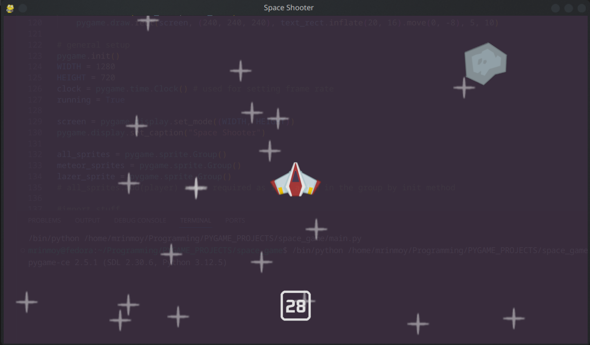

# Space Shooter Game

A simple 2D space shooting game where players control a spaceship to shoot down incoming meteors, build using pygame

## Features
- **Endless gameplay**: Survive as long as possible against meteorites.
- **Score system**: Compete for the highest score.
- **Simple controls**: Easy-to-learn controls make the game accessible to all players.
- **Smooth animations**: Fluid and responsive gameplay.

## Installation

### Prerequisites
- Python 3.x installed
- `pygame-ce` library installed

## Controls:

- `Arrow Keys`: Move left or right or diagonal
- `Spacebar`: Shoot

